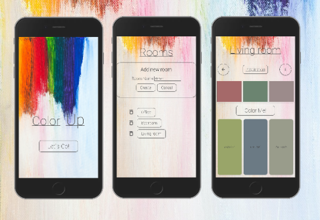

# ColorUp

## Capstone Project of the Web Development bootcamp at neuefische

ColorUP is a creative room color inspiration app. By simply inputting existing colors that are already prominent in your room, the user receives three suggestions for matching wall colors. Standing in an empty room and in need of inspiration for harmonious wall colors? Don't worry, just press the ispiration-button. Say goodbye to guesswork and unleash your creativity with ColorUp 🎨✨

### Deployment

You can have a look at the last update of ColorUp on Vercel: [DemoVersion](https://colorup.vercel.app)

### Tech Stack

- React
- React Hooks
- Next.js
- styled components
- tinycolor2
- mdi Pictogrammers
- uid
- react-confirm-alert

### Project Setup

- Clone this repository
- Install all dependencies using `npm install`
- Run app in development mode using `npm run dev`, and open [http://localhost:3000/](http://localhost:3000/)
